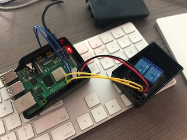
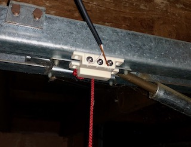
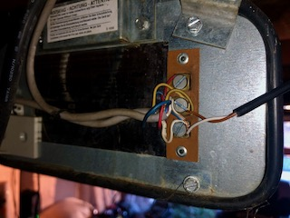

# homebridge-gpio-garagedoor
[RPi](https://www.raspberrypi.org) GPIO based Garage Door plugin for [Homebridge](https://github.com/nfarina/homebridge)

## Getting Started

This GPIO based Garage Door plugin uses a [Raspberry Pi](https://www.raspberrypi.org) equipped with [Homebridge](https://github.com/nfarina/homebridge), an external relay board and a reed switch to control a garage door through Apple's [HomeKit](https://www.apple.com/ios/home/).

This setup will work with most garage door openers which expect 2 connection points on the garage door opener to be connected to activate the garage door.

This plugin, together with HomeBridge, will allow you to view the status of your garage door, and activate opening or closing of your garage door with your Apple devices and Siri.

## Shopping list

To complete this installation, you need:

* A [Raspberry Pi](https://www.raspberrypi.org) board.
	* Any RaspBerry Pi will do (Zero, 1, 2, 3 or 4) but I suggest a board with pre-soldered pins.
	* Some boards include WiFi, others require an ethernet cable or additional WiFi USB dongle
	* Don't forget to include a power adapter and suitable case
* [Relay board](https://amzn.to/2WIeTvH)
	* For each door a separate relay is required. For 2 garage doors, select a 2 relay board.
	* Preferably also look into a separate housing to mount the relay board in.
* [Female to Female jumper wires](https://amzn.to/3dSQUiP)
	* One door requires 4 jumper wires
	* Any additional door requires 3 additional jumper wires
* [Reed switch](https://amzn.to/2Zd9mhZ) - one per garage door
* 2 pole wiring to reed switch, garage opener

## Software installation

Set up the Raspberry Pi to your liking. 

1. Install HomeBridge according to their [setup instructions](https://github.com/homebridge/homebridge/wiki).
2. Install this plugin using: npm install -g homebridge-gpio-garagedoor
3. Update your configuration file. See sample config.json snippet below. 

## Configuration

Configuration sample:

 ```
	"accessories": [
		{
			"accessory": "GPIOGarageDoor",
			"name": "Garage Door",
			"doorSwitchPin": 23,
			"doorSensorPin": 18,
			"isNCSensor": false,
			"doorOpensInSeconds": 14
		}
	]
```

Pins are according to GPIO numbering. Pin 23 in this example is BCM pin 23, board pin 16. Check the [Raspberry Pi Pinout](https://pinout.xyz) for more information.

Likewise, if you want to control 2 or more garage doors:

```
    "accessories": [
        {
            "accessory": "GPIOGarageDoor",
            "name": "Garage Wouter",
            "doorSwitchPin": 23,
            "doorSensorPin": 18,
            "isNCSensor": false,
            "doorOpensInSeconds": 14
        },
        {
            "accessory": "GPIOGarageDoor",
            "name": "Garage Aimée",
            "doorSwitchPin": 24,
            "doorSensorPin": 17,
            "isNCSensor": false,
            "doorOpensInSeconds": 14
        }
    ],
```

Fields: 

* "accessory": Must always be "GPIOGarageDoor" (required)
* "name": Can be anything (required)
* "doorSwitchPin": GPIO pin that is used to trigger the garage door switch (required)
* "doorSensorPin": GPIO pin that is used to detect if the state of the garage door (required)
* "isNCSensor": Specifies whether the door sensor is a Normally Closed (NC) type or Normally Open (NO) type (optional, default false NO)
* "doorOpensInSeconds": Number of seconds for the garage door to open completely (required)

## Testing the wiring

Following the pin layout in the above example configuration, we can connect the following:

| RPI pin | GPIO pin | Relay pin | Reed switch | Notes |
|---|---|---|---|---|
| 2 (5v power) | | 5v power | | |
| 6 (ground) | | ground | | |
| 16 | BCM 23 | in | | |
| 1 (3,3v)| | | COM | You will have to remove the female connector from the jumper wire, strip it and connect it to the reed switch |
| 12 | BCM 18 | | NO | You will have to remove the female connector from the jumper wire, strip it and connect it to the reed switch |



With this in place, and your garage door configured in HomeBridge, you should be able to test the following:
* placing the magnet next to the reed contact should render the status of your garage as "closed"
* when activating the garage door, you should hear the relay click and release, and a LED light light up and turn off

## Complete the hardware installation

If testing is succesful, you can complete the installation:

## Reed Switch



Mount the reed switch to a point where your garage would be in the closed position. I taped both the reed switch and its magnet to the chain rail, in which the magnet is mounted to the moving part connecting the chain to the garage. The reed switch is mounted to the outside of the chain rail.

### Garage Door motor



Check your garage door opener manual to determine which 2 contact points need to be connected to activate the door opener. These 2 contact points need to be connected to the COM and NO connectors on your relay board.